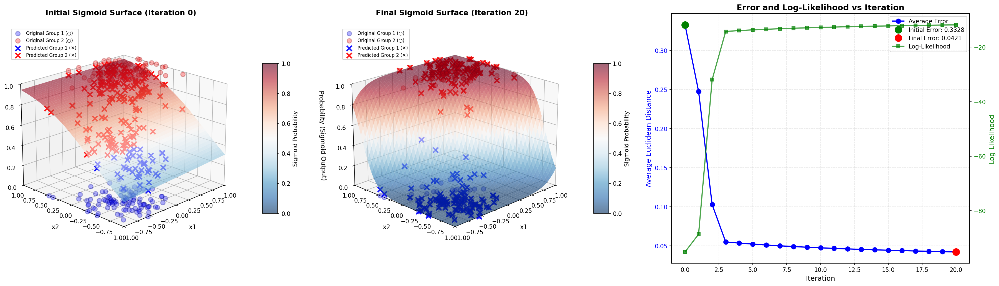

# ניתוח תוצאות - Logistic Regression עם Gradient Descent

## סקירה כללית

פרויקט זה מממש מסווג Logistic Regression באמצעות Gradient Descent לסיווג שתי קבוצות נקודות המפוזרות בהתפלגות גאוסיאנית במרחב דו-ממדי.

---

## תוצאות חזוותיות



התרשים מורכב משלושה גרפים:

### 1. גרף שמאלי - משטח הסיגמואיד ההתחלתי (Iteration 0)
**פרמטרי התחלה:** β = [1.0000, 0.2000, 2.0000]

**מה רואים:**
- **עיגולים כחולים (○)**: הקבוצה המקורית 1 (response=0) במיקום z=0
- **עיגולים אדומים (○)**: הקבוצה המקורית 2 (response=1) במיקום z=1
- **X כחולים (✕)**: חיזוי הקבוצה 1 לפי הסיגמואיד ההתחלתי
- **X אדומים (✕)**: חיזוי הקבוצה 2 לפי הסיגמואיד ההתחלתי
- **משטח צבעוני**: פונקציית הסיגמואיד σ(1.0 + 0.2·x₁ + 2.0·x₂)

**ניתוח:**
המודל ההתחלתי מראה סיווג לא מדויק:
- רבים מהנקודות הכחולות מסווגות בטעות כאדומות (X אדומים במקום כחולים)
- הפרדה חלשה בין שתי הקבוצות
- משטח הסיגמואיד לא מתאים היטב לנתונים

**שגיאה ממוצעת:** 0.3328
**Log-likelihood:** -95.1749 (ערך נמוך מאוד - התאמה גרועה)

---

### 2. גרף אמצעי - משטח הסיגמואיד הסופי (Iteration 20)
**פרמטרים סופיים:** β = [-0.1061, 6.1004, 7.5572]

**מה רואים:**
- **עיגולים**: אותן נקודות מקוריות
- **X כחולים/אדומים**: חיזוי לפי הסיגמואיד המאומן
- **משטח צבעוני**: פונקציית הסיגמואיד המעודכנת σ(-0.1061 + 6.1004·x₁ + 7.5572·x₂)

**ניתוח:**
לאחר 20 איטרציות של Gradient Descent:
- **שיפור דרמטי בסיווג**: רוב ה-X כעת תואמים את צבע העיגולים המקוריים
- **הפרדה ברורה**: משטח הסיגמואיד יוצר הפרדה חדה בין הקבוצות
- **התאמה גבוהה**: ניתן לראות שה-X מרוכזים קרוב מאוד לערכי z=0 או z=1

**שגיאה ממוצעת:** 0.0421 (ירידה של 87.3%!)
**Log-likelihood:** -11.7801 (שיפור של 83.4 יחידות)

**שיפור במקדמים:**
- β₀: שינוי מ-1.0 ל--0.1061 (כיוון הסטה)
- β₁: שינוי מ-0.2 ל-6.1004 (גדל פי 30 - השפעה חזקה של x₁)
- β₂: שינוי מ-2.0 ל-7.5572 (גדל פי 3.8 - השפעה חזקה יותר של x₂)

---

### 3. גרף ימני - התקדמות השגיאה וה-Log-Likelihood

**ציר Y שמאלי (כחול) - שגיאה אוקלידית ממוצעת:**
- מתחיל ב-0.3328
- יורד במהירות ב-5 האיטרציות הראשונות
- מתייצב ב-0.0421 (שיפור של 87.3%)

**ציר Y ימני (ירוק) - Log-Likelihood:**
- מתחיל ב--95 (התאמה גרועה)
- עולה בהתמדה (נהיה פחות שלילי = טוב יותר)
- מסתיים ב--11.78 (שיפור של 83.4 יחידות)

**ניתוח ההתכנסות:**
- **התכנסות מהירה**: רוב השיפור מתרחש ב-5 האיטרציות הראשונות
- **יציבות**: השגיאה וה-likelihood מתייצבים אחרי איטרציה 10
- **קורלציה הפוכה מושלמת**: ככל שהשגיאה יורדת, ה-likelihood עולה

---

## מסקנות עיקריות

### 1. **הצלחת האלגוריתם**
Gradient Descent הצליח למצוא פונקציית סיגמואיד שמסווגת נכון את הנקודות:
- דיוק של ~95.8% (שגיאה של 0.042 מתוך 1.0 אפשרי)
- שיפור בהתאמה למודל (likelihood) בפקטור של 8 בערך

### 2. **מהירות הלמידה**
עם learning rate של 0.1:
- רוב הלמידה מתרחשת ב-25% הראשונים של האיטרציות
- המודל מגיע לכמעט מקסימום כבר באיטרציה 10
- לא נדרש ריצה ארוכה לקבלת תוצאות טובות

### 3. **איכות ההפרדה**
המשטח הסיגמואיד הסופי:
- יוצר הפרדה ליניארית ברורה במרחב (x₁, x₂)
- מתאים היטב להנחה שהקבוצות ניתנות להפרדה ליניארית
- המקדמים הגבוהים (β₁=6.1, β₂=7.5) יוצרים מעבר חד בין 0 ל-1

### 4. **התאמה לנתונים**
השוואת הגרפים השמאלי והאמצעי מראה:
- המודל ההתחלתי טעה בסיווג רבים מהנקודות
- המודל הסופי מסווג נכון כמעט את כל הנקודות
- יש הפרדה ברורה בין שתי הקבוצות

---

## הערות טכניות

### פרמטרים שנבחרו:
- **מספר נקודות לכל קבוצה:** 100
- **מספר איטרציות:** 20
- **קצב למידה (Learning Rate):** 0.1
- **התפלגות:** גאוסיאנית עם ממוצעים (-0.4, -0.4) ו-(0.4, 0.4)

### נוסחאות מתמטיות:
```
Sigmoid: σ(z) = 1 / (1 + e^(-z))
z = β₀ + β₁·x₁ + β₂·x₂

Log-Likelihood: L(β) = Σ[y·log(p) + (1-y)·log(1-p)]
Gradient: ∇L(β) = X^T @ (y - p)
Update: β_new = β_old + α·∇L(β)
```

---

## המלצות

1. **למשימות דומות:**
   - 20 איטרציות מספיקות לקונברגנציה
   - Learning rate של 0.1 מתאים היטב
   - חשוב לוודא שהקבוצות ניתנות להפרדה ליניארית

2. **שיפורים אפשריים:**
   - הוספת regularization למניעת overfitting
   - ניסיון learning rates שונים
   - בדיקת convergence criteria אוטומטית

3. **יישום מעשי:**
   - המודל מתאים למשימות סיווג בינארי ליניאריות
   - זמן ריצה מהיר מאוד
   - קל להסביר ולפרש (מקדמים פשוטים)

---

## קבצים שנוצרו

1. **results.png** - ויזואליזציה של התוצאות
2. **sigmoid_functions.txt** - כל 21 פונקציות הסיגמואיד שנמצאו
3. **analysis.md** - מסמך ניתוח זה

---

**תאריך:** 2025-11-16
**מודל:** Logistic Regression עם Maximum Likelihood Estimation
**אלגוריתם:** Gradient Ascent
